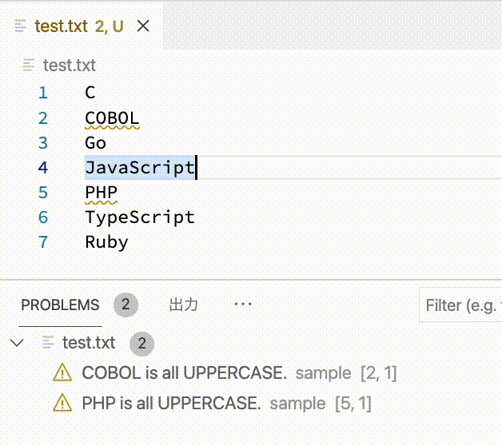

# COVLint

MS サンプルコード lsp-sample で上書きし、CSVファイルのオープン処理を追加しました

---
[@Ikuyadeu](https://qiita.com/Ikuyadeu) 氏の記事 [Language Server Protocol開発チュートリアル](https://qiita.com/Ikuyadeu/items/98458f9ab760d09660ff) 学習ページです

---
vscode-language-server-template Linter版 README

"vscode-language-server-template"を用いたLinterを作成します。

## 機能

* コード検証機能
  * ３文字以上の大文字を検出します。
* コード修正機能
  * 警告箇所を小文字に修正します
