# COVLint

`Coverity Connect`サーバーの特長の一つである問題のある行に指摘が付いたソースコード画面を`Visual Studio Code`上に実現しました。`Language Server Protocol`（言語サーバー）を利用していますので、言語サーバーの機能がある`Atom`、`Vim`や`Emacs`などのエディターで動作します（と言われていますが未確認です）。

- Coverity Connect ソースコード画面
  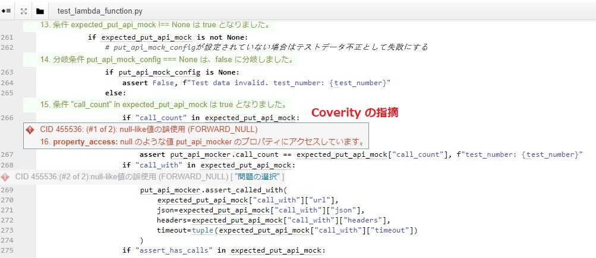

- COVLint ソースコード画面
  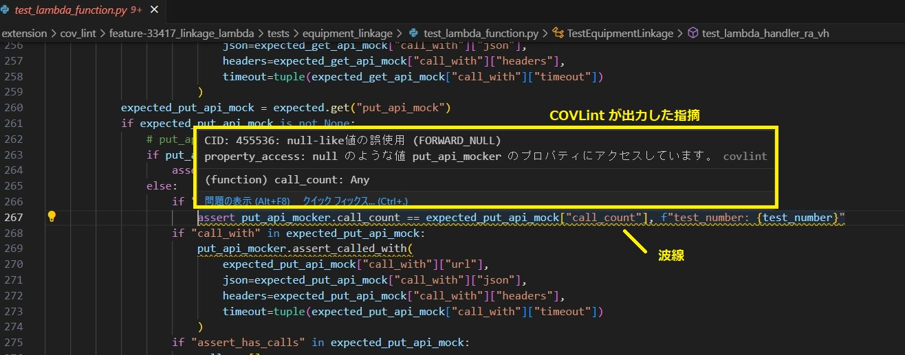

- COVLint ソースコード画面（指摘を複数表示）
  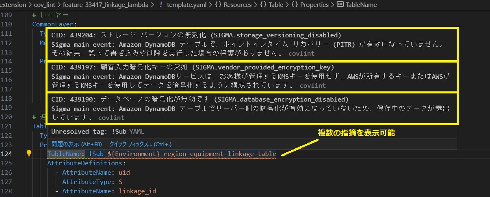

`COVLint`は、`Coverity`が解析したソースコードの指摘結果を `Visual Studio Code` に表示します。
指摘結果は、スクリプト`cov_snap`が取得したCSVファイルから読み込みます。
`cov_snap`は、`Coverity Connect` サーバーに登録されているソースコードの指摘内容を取得するスクリプトです。

## 実施手順

### 1. COVLint拡張機能のインストール

- アクティビティーバーから拡張機能を選択します
  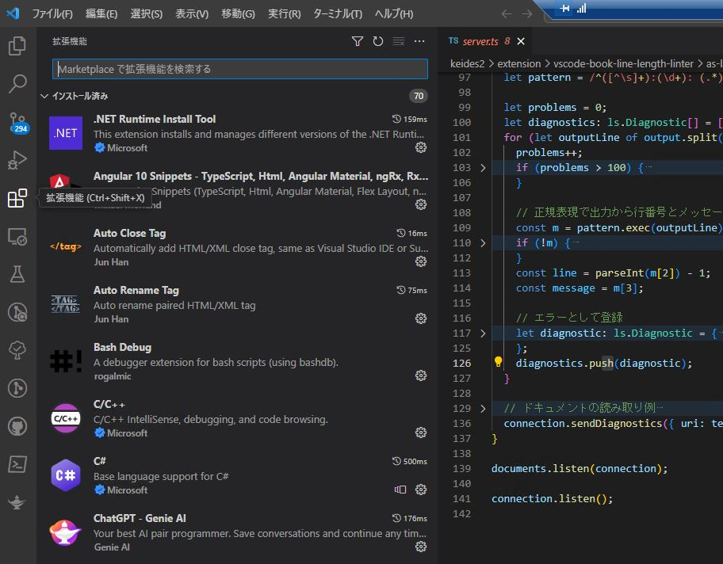

- 3点メニューから「VSIXからインストール」を選択します
  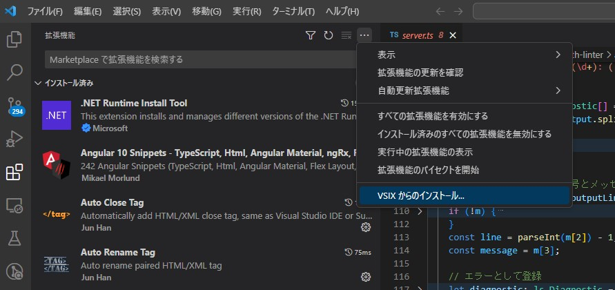

- ファイル「covlint-0.0.1.vsix」をインストールします
  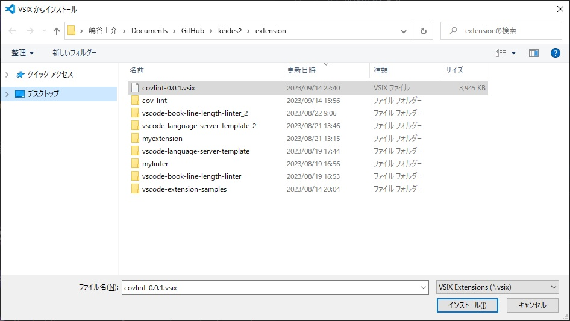

- インストール完了です
  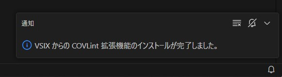

- 拡張機能 `COVLint`
  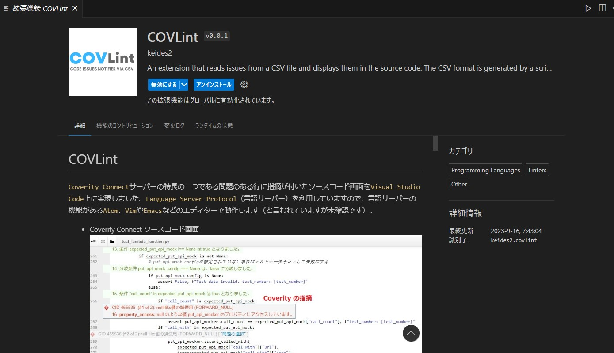

### 2. CSVファイルの読み込み

`cov_snap`で取得したスナップショットCSVファイルを読み込みます

- VSCodeのエクスプローラーからスナップショットを保存しているフォルダに移動し、読み込みむスナップショットを**右クリック**で選択します（左クリックでファイルの中身を表示する必要はありません）
  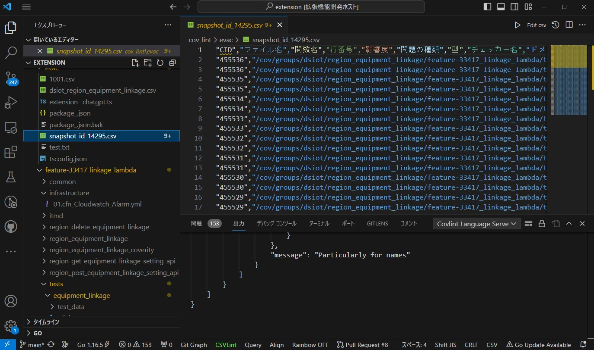

- メニューから「パスのコピー」を選択します
  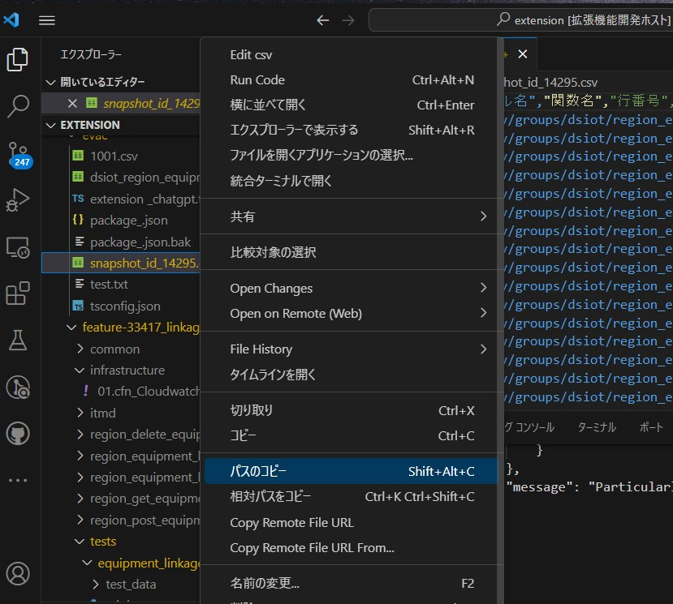

- `Ctrl` + `Shift` + `p`を押してコマンドパレットを開き、`COVLint: open CSV file`を選択します
  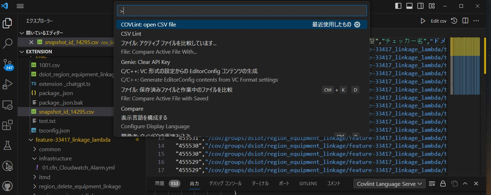

- 入力ボックスにコピーしたスナップショットCSVファイルのパスを貼り付けます
  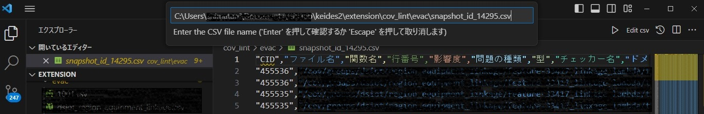

- 何も入力しなかったときのメッセージです
  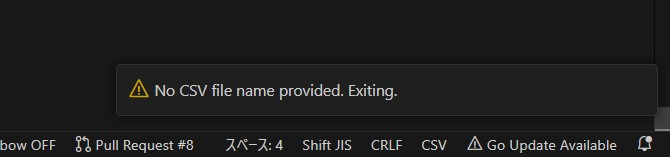

- 読み込みに成功したときのメッセージです
  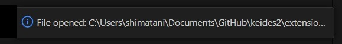

- 読み込みに失敗したときはリトライしてください
  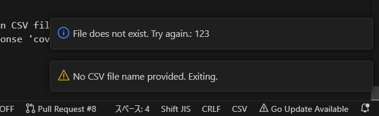

### 3. 指摘の表示

- フォルダを移動して開発中のソースコードを選択します
  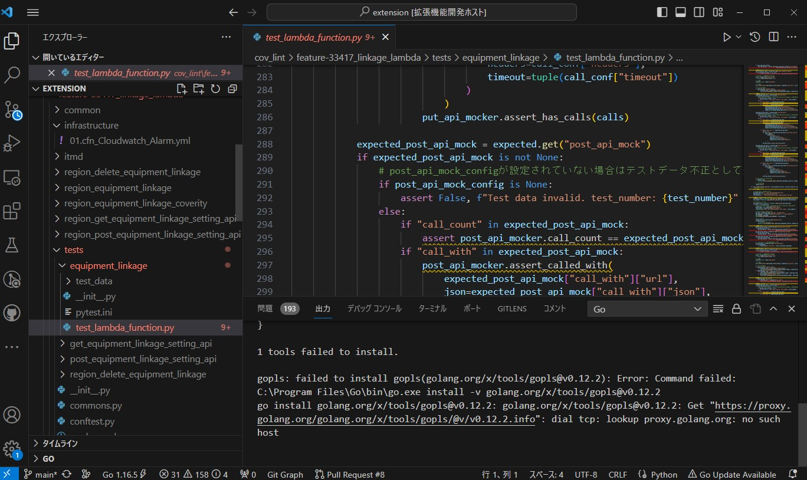

- ソースコードの問題のある行に波線が入っているのでマウスオーバーします
  - 指摘がポップアップ表示されます
  - 問題パネルに指摘の一覧が表示されます
  - 問題を左クリックすると該当行にジャンプします
  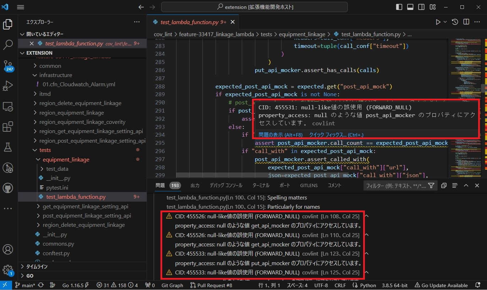

## 備考

Microsoftの`https://github.com/Microsoft/vscode-extension-samples`にある`lsp-sample`や、[@Ikuyadeu](https://qiita.com/Ikuyadeu) 氏の記事 [Language Server Protocol開発チュートリアル](https://qiita.com/Ikuyadeu/items/98458f9ab760d09660ff) をベースにしましたので次の機能が残っています。

- コード検証機能
  - ３文字以上の大文字を検出します
- コード修正機能
  - 警告箇所を小文字に修正します

下図は`vscode-language-server-template Linter` README から。

---
2023/09/15 嶋谷 初版
