# COVLint (in English)

`Coverity Connect` server has a feature that highlights problematic lines in the source code. This feature has been implemented in `Visual Studio Code`. By using the `Language Server Protocol`, it also works in editors like `Atom`, `Vim`, and `Emacs` that support the language server (though this hasn't been confirmed).

- Coverity Connect Source Code Screen
  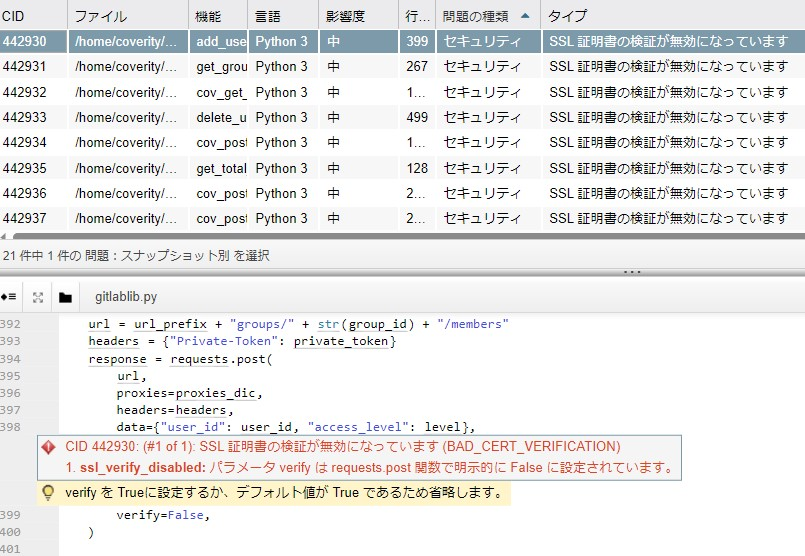

- COVLint Source Code Screen
  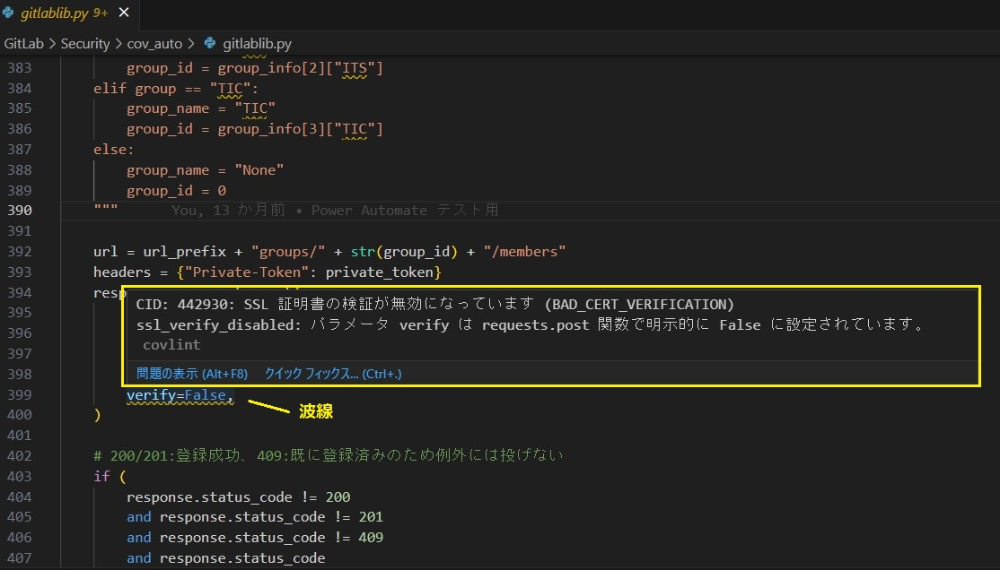

- COVLint Source Code Screen (Multiple Highlights)
  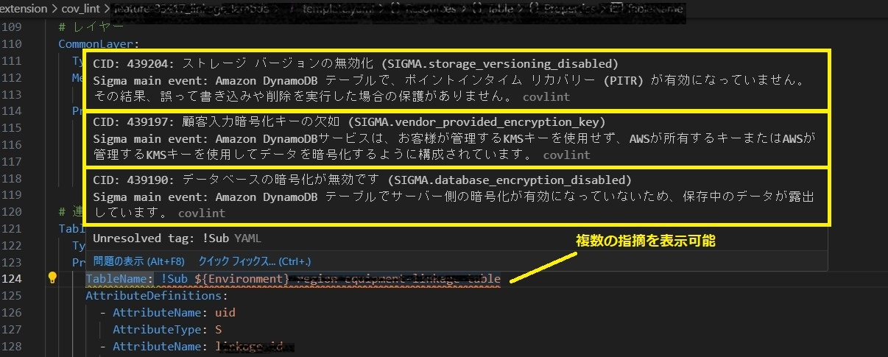

`COVLint` displays the analysis results of the source code by `Coverity` in `Visual Studio Code`. The results are read from a CSV file obtained by the `cov_snap` script. `cov_snap` is a script that fetches the annotations of the source code registered on the `Coverity Connect` server.

## Procedure

### 1. Installing the COVLint Extension

There are two ways to install `COVLint`: from a VSIX package file or from the VSCode Extension Marketplace.

- Select extensions from the activity bar
  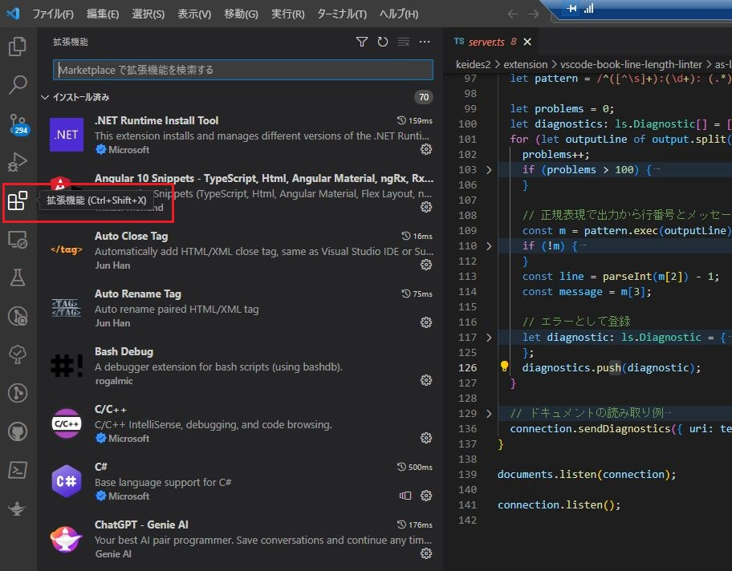

#### 1.1 Installation from VSIX Package File

- From the three-dot menu, select "Install from VSIX"
  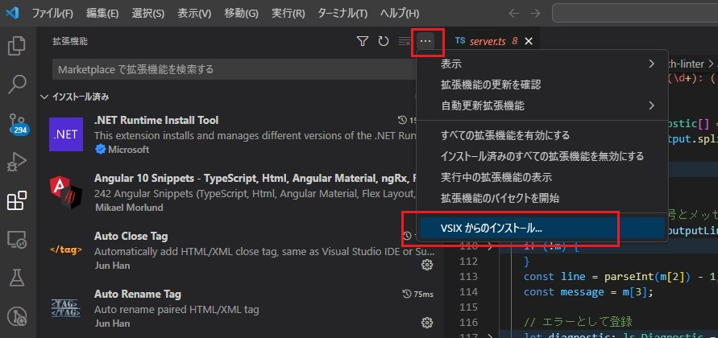

- Install the file `covlint-X.Y.Z.vsix`
  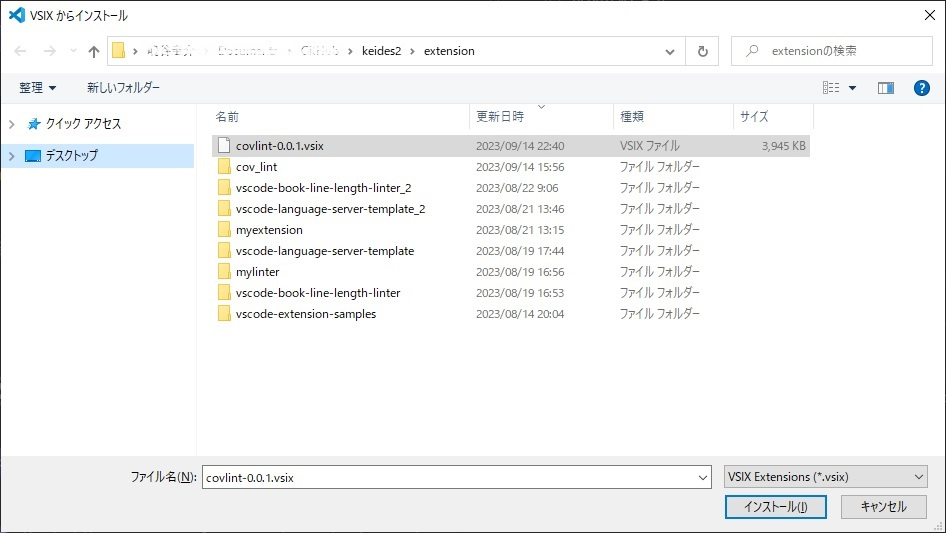

- Installation is complete
  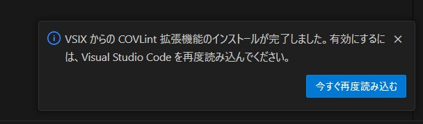

- `COVLint` Extension
  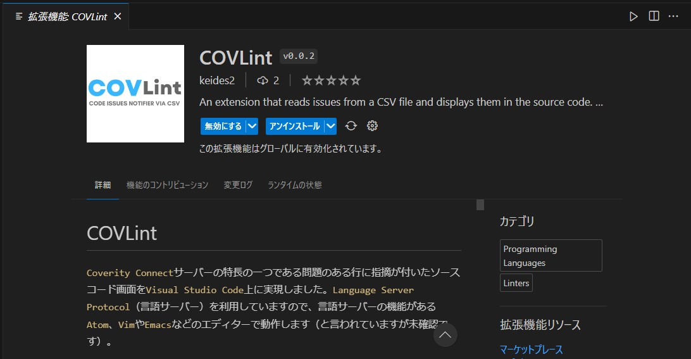

#### 1.2 Installation from VSCode Extension Marketplace

- Enter `covlint` in the search box and click "Install"
  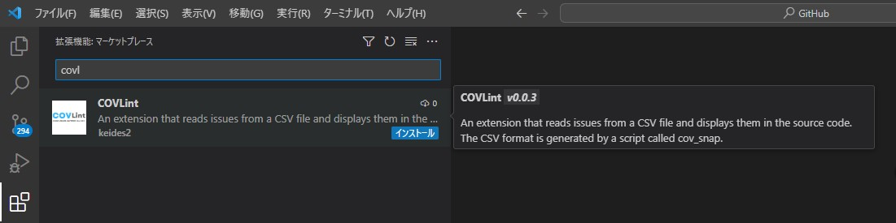

- Installation is complete
  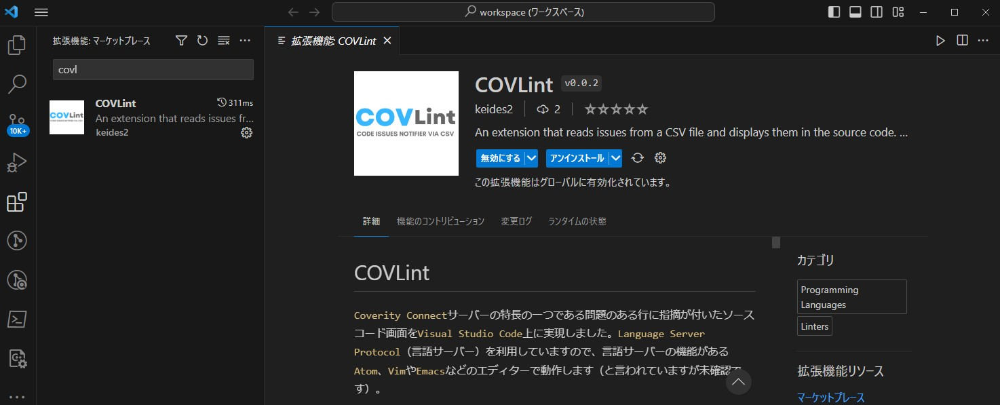

### 2. Loading the CSV File

Load the snapshot CSV file obtained with `cov_snap`.

- Move to the folder where the snapshot is saved from VSCode's explorer and **right-click** to select the snapshot (you don't need to display the contents of the file with a left click)
  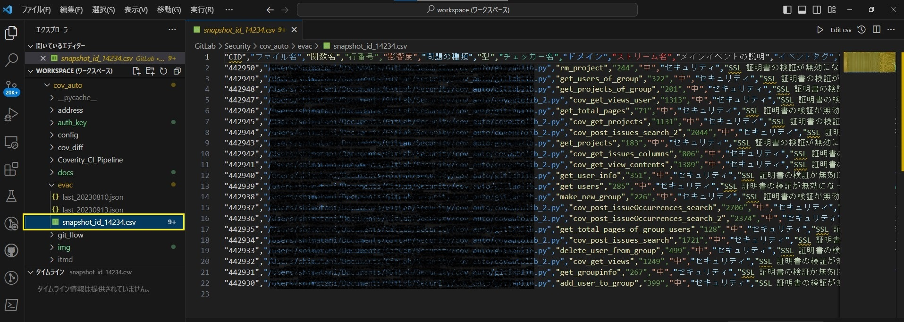

- From the menu, select "Copy Path"
  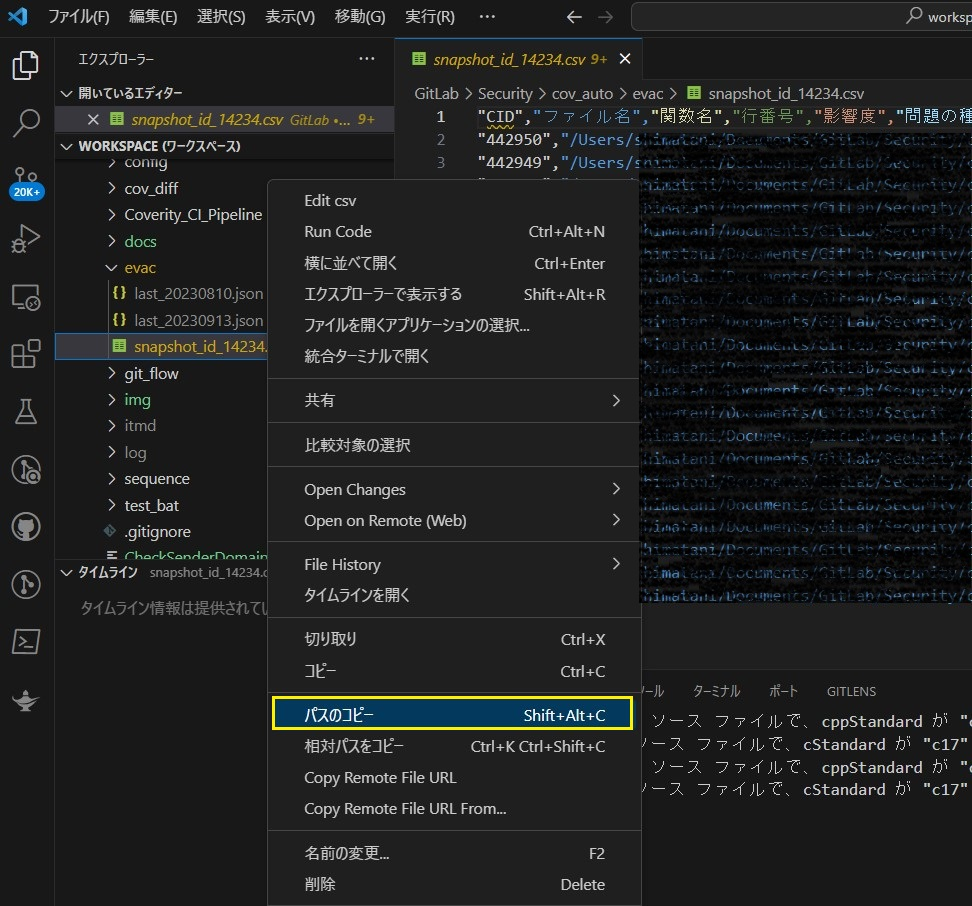

- Press `Ctrl` + `Shift` + `p` to open the command palette and select `COVLint: open CSV file`
  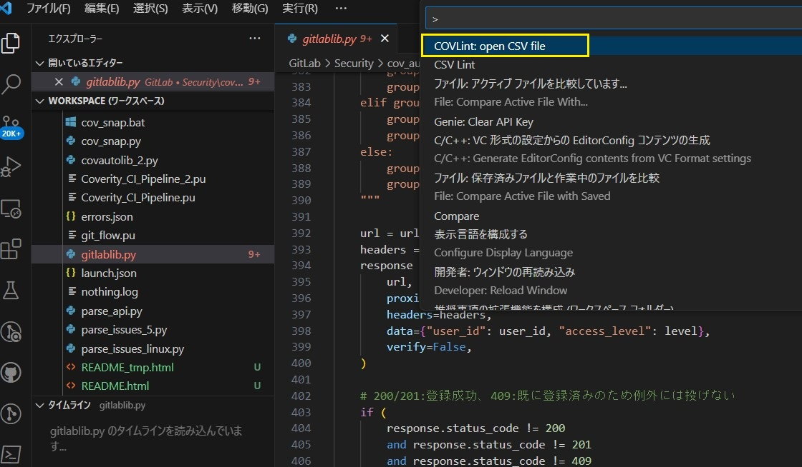

- Paste the path of the copied snapshot CSV file into the input box
  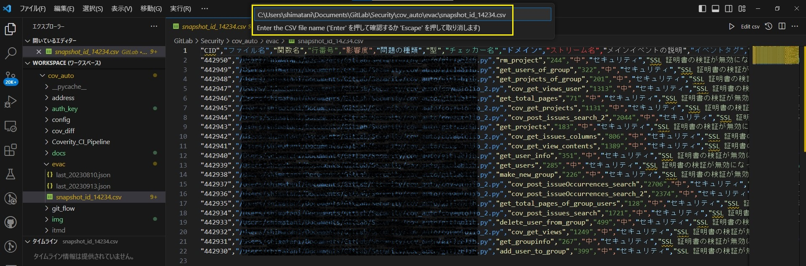

- Message when no input is made
  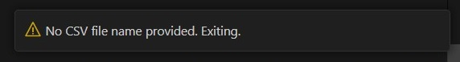

- Message when loading is successful
  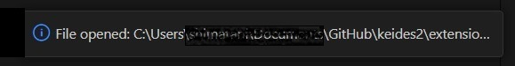

- If loading fails, please retry
  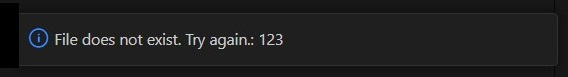

### 3. Displaying Annotations

- Move the folder and select the source code you are developing
  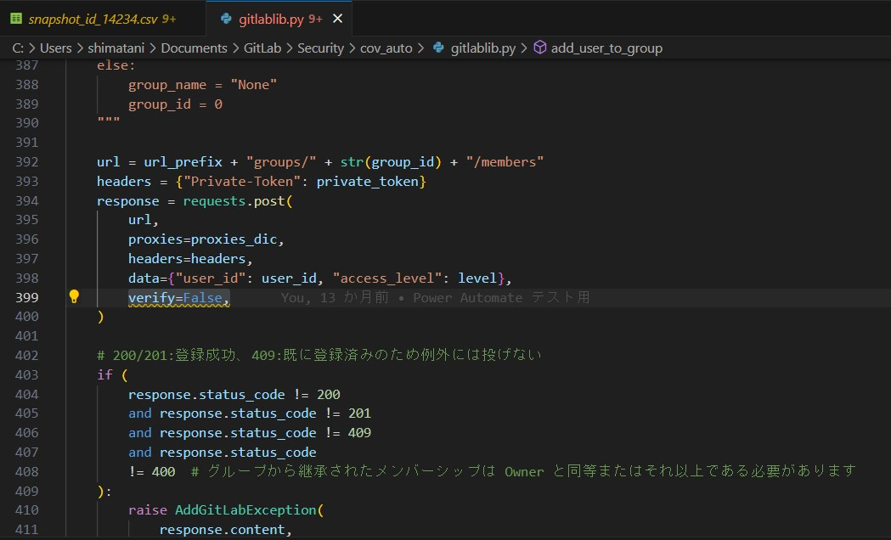

- Lines with issues in the source code are underlined, so hover over them
  - Annotations will be displayed in a popup
  - A list of annotations will be displayed in the problem panel
  - Clicking on an issue will jump to the corresponding line
  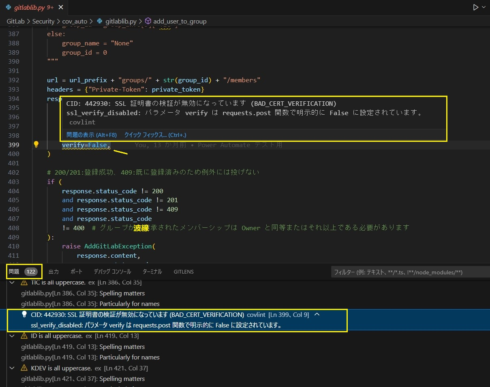

## Notes

This was based on Microsoft's `https://github.com/Microsoft/vscode-extension-samples` `lsp-sample` and an article by [@Ikuyadeu](https://qiita.com/Ikuyadeu) titled [Language Server Protocol Development Tutorial](https://qiita.com/Ikuyadeu/items/98458f9ab760d09660ff). 

---

- 2023/09/15 keides2 v0.0.1 First edition
- 2023/09/16 keides2 v0.0.2 Image replacement
- 2023/09/17 keides2 v0.0.3 Extension Marketplace support
- 2023/09/20 keides2 v0.1.0 webpack
- 2023/10/07 keides2 V0.2.0 Removed the uppercase character detection function for 3 or more characters.
  
---
# COVLint (in Japanese)

`Coverity Connect`サーバーの特長の一つである問題のある行に指摘が付いたソースコード画面を`Visual Studio Code`上に実現しました。`Language Server Protocol`（言語サーバー）を利用していますので、言語サーバーの機能がある`Atom`、`Vim`や`Emacs`などのエディターで動作します（と言われていますが未確認です）。

- Coverity Connect ソースコード画面
  

- COVLint ソースコード画面
  

- COVLint ソースコード画面（指摘を複数表示）
  

`COVLint`は、`Coverity`が解析したソースコードの指摘結果を `Visual Studio Code` に表示します。
指摘結果は、スクリプト`cov_snap`が取得したCSVファイルから読み込みます。
`cov_snap`は、`Coverity Connect` サーバーに登録されているソースコードの指摘内容を取得するスクリプトです。

## 実施手順

### 1. COVLint拡張機能のインストール

`COVLint`は、VSIXパッケージファイルからインストールする方法と、VSCode拡張機能マーケットプレースからインストールする方法があります。

- アクティビティーバーから拡張機能を選択します
  

#### 1.1 VSIXパッケージファイルからのインストール

- 3点メニューから「VSIXからインストール」を選択します
  

- ファイル「covlint-X.Y.Z.vsix」をインストールします
  

- インストール完了です
  

- 拡張機能 `COVLint`
  

#### 1.2 VSCode拡張機能マーケットプレースからのインストール

- 検索窓に`covlint`を入力し、「インストール」を押下げます
  

- インストール完了です
  

### 2. CSVファイルの読み込み

`cov_snap`で取得したスナップショットCSVファイルを読み込みます

- VSCodeのエクスプローラーからスナップショットを保存しているフォルダに移動し、読み込みむスナップショットを**右クリック**で選択します（左クリックでファイルの中身を表示する必要はありません）
  

- メニューから「パスのコピー」を選択します
  

- `Ctrl` + `Shift` + `p`を押してコマンドパレットを開き、`COVLint: open CSV file`を選択します
  

- 入力ボックスにコピーしたスナップショットCSVファイルのパスを貼り付けます
  

- 何も入力しなかったときのメッセージです
  

- 読み込みに成功したときのメッセージです
  

- 読み込みに失敗したときはリトライしてください
  

### 3. 指摘の表示

- フォルダを移動して開発中のソースコードを選択します
  

- ソースコードの問題のある行に波線が入っているのでマウスオーバーします
  - 指摘がポップアップ表示されます
  - 問題パネルに指摘の一覧が表示されます
  - 問題を左クリックすると該当行にジャンプします
  

## 備考

Microsoftの`https://github.com/Microsoft/vscode-extension-samples`にある`lsp-sample`や、[@Ikuyadeu](https://qiita.com/Ikuyadeu) 氏の記事 [Language Server Protocol開発チュートリアル](https://qiita.com/Ikuyadeu/items/98458f9ab760d09660ff) を参考にしました。

---

- 2023/09/15 keides2 v0.0.1 初版
- 2023/09/16 keides2 v0.0.2 図の差し替え
- 2023/09/17 keides2 v0.0.3 拡張機能マーケットプレース対応
- 2023/09/20 keides2 v0.1.0 webpack 対応。英文追加
- 2023/10/07 keides2 V0.2.0 ３文字以上の大文字検出をやめる
  